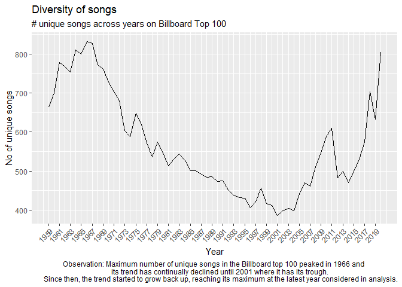
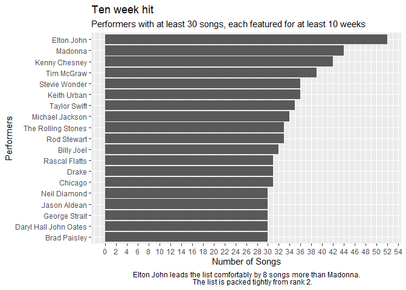

Q2. Wrangling the Billboard Top 100
================

**Consider the data in billboard.csv containing every song to appear on
the weekly Billboard Top 100 chart since 1958, up through the middle of
2021. Each row of this data corresponds to a single song in a single
week. For our purposes, the relevant columns here are:**

    performer: who performed the song
    song: the title of the song
    year: year (1958 to 2021)
    week: chart week of that year (1, 2, etc)
    week_position: what position that song occupied that week on the Billboard top 100 chart.

Use your skills in data wrangling and plotting to answer the following
three questions.

``` r
library(dplyr)
```

    ## 
    ## Attaching package: 'dplyr'

    ## The following objects are masked from 'package:stats':
    ## 
    ##     filter, lag

    ## The following objects are masked from 'package:base':
    ## 
    ##     intersect, setdiff, setequal, union

``` r
library(ggplot2)
```

**Part A:** Make a table of the top 10 most popular songs since 1958, as
measured by the total number of weeks that a song spent on the Billboard
Top 100. Note that these data end in week 22 of 2021, so the most
popular songs of 2021 will not have up-to-the-minute data; please send
our apologies to The Weeknd.

Your table should have 10 rows and 3 columns: performer, song, and
count, where count represents the number of weeks that song appeared in
the Billboard Top 100. Make sure the entries are sorted in descending
order of the count variable, so that the more popular songs appear at
the top of the table. Give your table a short caption describing what is
shown in the table.

(Note: you’ll want to use both performer and song in any group_by
operations, to account for the fact that multiple unique songs can share
the same title.)

**Solution:**

``` r
billboard = read.csv("billboard.csv")

billboard$X = NULL

relevantColumns = c("performer", "song", "year", "week", "week_position")

billboardRelevant = billboard[relevantColumns]

billboardTop = billboardRelevant %>% 
  filter(week_position <= 100, year >= 1958) %>%
  group_by(performer, song) %>% 
  summarise(count = n(), .groups = 'drop') %>% 
  arrange(desc(count))

tenthValue = unique(billboardTop$count)[10]

billboardTop10 = billboardTop %>% 
  filter(count >= tenthValue)

print(billboardTop10)
```

    ## # A tibble: 17 x 3
    ##    performer                                 song                          count
    ##    <chr>                                     <chr>                         <int>
    ##  1 Imagine Dragons                           Radioactive                      87
    ##  2 AWOLNATION                                Sail                             79
    ##  3 Jason Mraz                                I'm Yours                        76
    ##  4 The Weeknd                                Blinding Lights                  76
    ##  5 LeAnn Rimes                               How Do I Live                    69
    ##  6 LMFAO Featuring Lauren Bennett & GoonRock Party Rock Anthem                68
    ##  7 OneRepublic                               Counting Stars                   68
    ##  8 Adele                                     Rolling In The Deep              65
    ##  9 Jewel                                     Foolish Games/You Were Meant~    65
    ## 10 Carrie Underwood                          Before He Cheats                 64
    ## 11 Gabby Barrett Featuring Charlie Puth      I Hope                           62
    ## 12 Lifehouse                                 You And Me                       62
    ## 13 The Lumineers                             Ho Hey                           62
    ## 14 Imagine Dragons                           Demons                           61
    ## 15 Post Malone                               Circles                          61
    ## 16 Lady Antebellum                           Need You Now                     60
    ## 17 Los Del Rio                               Macarena (Bayside Boys Mix)      60

**Part B:** Is the “musical diversity” of the Billboard Top 100 changing
over time? Let’s find out. We’ll measure the musical diversity of given
year as the number of unique songs that appeared in the Billboard Top
100 that year. Make a line graph that plots this measure of musical
diversity over the years. The x axis should show the year, while the y
axis should show the number of unique songs appearing at any position on
the Billboard Top 100 chart in any week that year. For this part, please
filter the data set so that it excludes the years 1958 and 2021, since
we do not have complete data on either of those years. Give the figure
an informative caption in which you explain what is shown in the figure
and comment on any interesting trends you see.

There are number of ways to accomplish the data wrangling here. For
example, you could use two distinct sets of data-wrangling steps. The
first set of steps would get you a table that counts the number of times
that a given song appears on the Top 100 in a given year. The second set
of steps operate on the result of the first set of steps; it would count
the number of unique songs that appeared on the Top 100 in each year,
irrespective of how many times it had appeared.

**Solution:**

``` r
#b.

billboardTop100AnyTimePerYear = billboardRelevant %>% 
  filter(week_position <= 100)

billboardTop100AnyTimePerYearCount = billboardTop100AnyTimePerYear %>% 
  group_by(year) %>% 
  summarise(countOfSongs = n_distinct(performer, song))

ggplot(data = billboardTop100AnyTimePerYearCount[billboardTop100AnyTimePerYearCount$year > 1958 
                                                 & billboardTop100AnyTimePerYearCount$year < 2021, ]) +
  geom_line(aes(x = year, y = countOfSongs)) +
  scale_x_continuous(breaks = seq(1959, 2020, 2), guide = guide_axis(angle = 45)) +
  xlab(label = "Year") +
  ylab(label = "No of unique songs") +
  labs(title = "Diversity of songs",
       subtitle = "# unique songs across years on Billboard Top 100",
       caption = "Observation: Maximum number of unique songs in the Billboard top 100 peaked in 1966 and 
       its trend has continually declined until 2001 where it has its trough. 
       Since then, the trend started to grow back up, reaching its maximum at the latest year considered in analysis.") +
  theme(plot.caption = element_text(hjust = 0.5))
```

<!-- -->

**Part C:** Let’s define a “ten-week hit” as a single song that appeared
on the Billboard Top 100 for at least ten weeks. There are 19 artists in
U.S. musical history since 1958 who have had at least 30 songs that were
“ten-week hits.” Make a bar plot for these 19 artists, showing how many
ten-week hits each one had in their musical career. Give the plot an
informative caption in which you explain what is shown.

**Solution:**

``` r
tenWeekHit = billboardRelevant %>% 
  filter(week_position <= 100) %>% 
  group_by(performer, song) %>% 
  summarise(songsWeeklyCount = n()) %>% 
  filter(songsWeeklyCount >= 10) %>% 
  group_by(performer) %>% 
  summarise(songsCount = n()) %>% 
  filter(songsCount >= 30)
```

    ## `summarise()` has grouped output by 'performer'. You can override using the
    ## `.groups` argument.

``` r
ggplot(data = tenWeekHit) + 
  geom_col(aes(x = reorder(performer, songsCount), y = songsCount)) + 
  coord_flip() +
  scale_y_continuous(breaks = seq(0, 60, 2)) +
  xlab(label = "Performers") +
  ylab(label = "Number of Songs") +
  labs(title = "Ten week hit",
       subtitle = "Performers with at least 30 songs, each featured for at least 10 weeks", 
       caption = "Elton John leads the list comfortably by 8 songs more than Madonna.
       The list is packed tightly from rank 2.") +
  theme(plot.caption = element_text(hjust = 0.5))
```

<!-- -->
