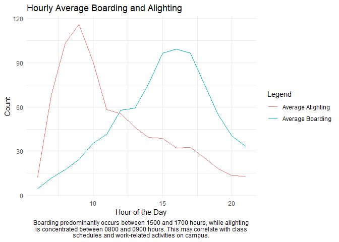
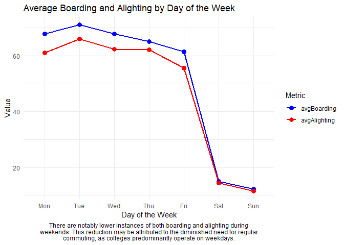
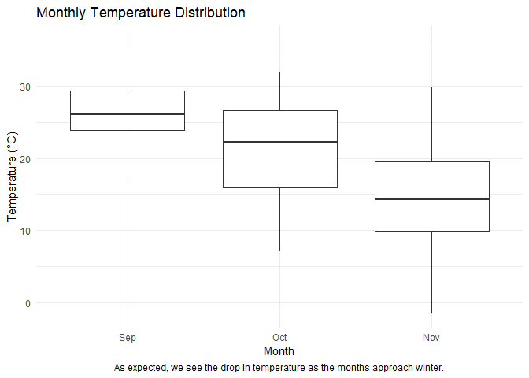
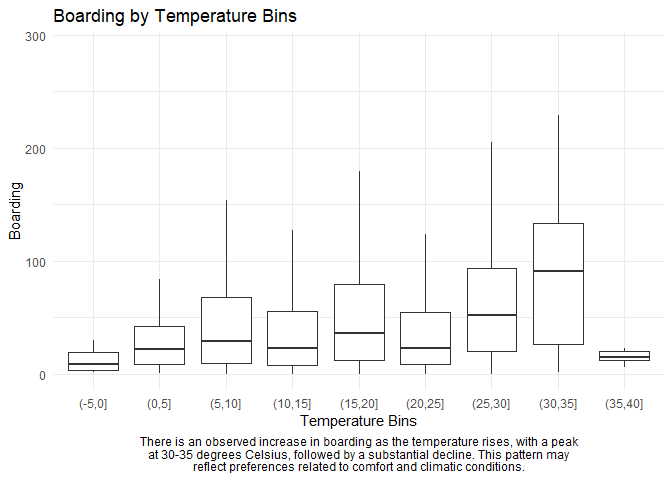
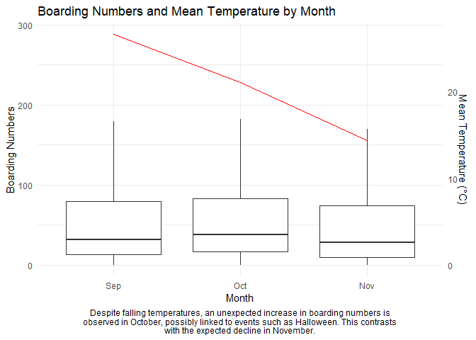
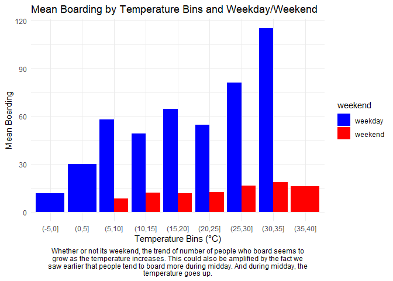
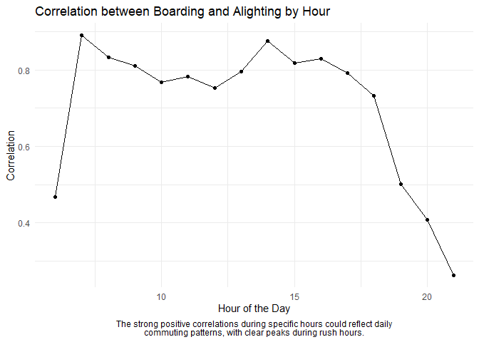
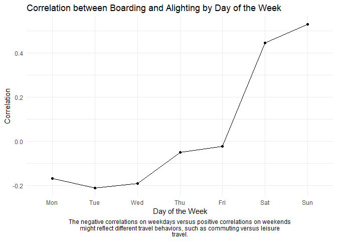
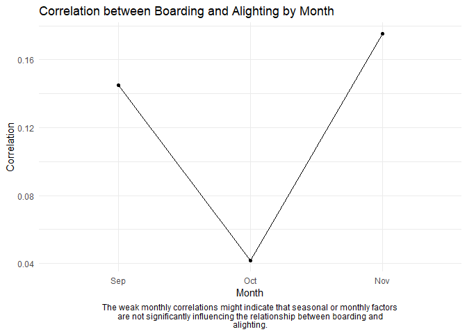

Q4. Visual story telling part 2: Capital Metro data
================

The file capmetro_UT.csv contains data from Austin’s own Capital Metro
bus network, including shuttles to, from, and around the UT campus.
These data track ridership on buses in the UT area. Ridership is
measured by an optical scanner that counts how many people embark and
alight the bus at each stop. Each row in the data set corresponds to a
15-minute period between the hours of 6 AM and 10 PM, each and every
day, from September through November 2018. The variables are:

    timestamp: the beginning of the 15-minute window for that row of data
    boarding: how many people got on board any Capital Metro bus on the UT campus in the specific 15 minute window
    alighting: how many people got off ("alit") any Capital Metro bus on the UT campus in the specific 15 minute window
    day_of_week and weekend: Monday, Tuesday, etc, as well as an indicator for whether it's a weekend.
    temperature: temperature at that time in degrees F
    hour_of_day: on 24-hour time, so 6 for 6 AM, 13 for 1 PM, 14 for 2 PM, etc.
    month: July through December

Your task is to create a figure, or set of related figures, that tell an
interesting story about Capital Metro ridership patterns around the
UT-Austin campus during the semester in question. Provide a clear
annotation/caption for each figure, but the figure(s) should be more or
less stand-alone, in that you shouldn’t need many, many paragraphs to
convey its meaning. Rather, the figure together with a concise caption
should speak for itself as far as possible.

You have broad freedom to look at any variables you’d like here – try to
find that sweet spot where you’re showing genuinely interesting
relationships among more than just two variables, but where the
resulting figure or set of figures doesn’t become
overwhelming/confusing. (Faceting/panel plots might be especially useful
here.)

**Solution:**

``` r
library(ggplot2)
library(lubridate)
```

    ## 
    ## Attaching package: 'lubridate'

    ## The following objects are masked from 'package:base':
    ## 
    ##     date, intersect, setdiff, union

``` r
library(dplyr)
```

    ## 
    ## Attaching package: 'dplyr'

    ## The following objects are masked from 'package:stats':
    ## 
    ##     filter, lag

    ## The following objects are masked from 'package:base':
    ## 
    ##     intersect, setdiff, setequal, union

``` r
library(reshape2)
```

    ## Warning: package 'reshape2' was built under R version 4.0.5

``` r
library(stringr)
```

``` r
capMetro = read.csv("C:/Users/kkart/OneDrive/McCombsMSBA/Intro to ML/New folder/STA380/STA380-master/data/capmetro_UT.csv")
```

**What are the identified peak hours for boarding and alighting, and how
do these align with the daily activities within the university
community?**

``` r
hourlyBoardingAlighting = capMetro %>% group_by(hour_of_day) %>% summarise(avgBoarding = mean(boarding), avgAlighting = mean(alighting))

captionText = "Boarding predominantly occurs between 1500 and 1700 hours, while alighting is concentrated between 0800 and 0900 hours. This may correlate with class schedules and work-related activities on campus."
wrappedCaption = str_wrap(captionText, width = 80) # Adjust the width as needed

ggplot(hourlyBoardingAlighting, aes(x = hour_of_day)) +
  geom_line(aes(y = avgBoarding, color = "Average Boarding")) +
  geom_line(aes(y = avgAlighting, color = "Average Alighting")) +
  labs(title = "Hourly Average Boarding and Alighting",
       x = "Hour of the Day",
       y = "Count",
       color = "Legend",
       caption = wrappedCaption) +
  theme_minimal() +
  theme(plot.caption = element_text(hjust = 0.5))
```

<!-- -->
**How does the ridership differ between weekdays and weekends, and what
implications does this have for understanding campus dynamics?**

``` r
capMetro$timestamp = ymd_hms(capMetro$timestamp, tz = "America/Chicago")

capMetro$temperature = (capMetro$temperature - 32)*5/9

weeklyBoardingAlighting = capMetro %>% group_by(day_of_week) %>% summarise(avgBoarding = mean(boarding), avgAlighting = mean(alighting))

longData <- melt(weeklyBoardingAlighting, id.vars = "day_of_week", variable.name = "metric", value.name = "value")
longData$day_of_week <- factor(longData$day_of_week, levels = c("Mon", "Tue", "Wed", "Thu", "Fri", "Sat", "Sun"))

captionText = "There are notably lower instances of both boarding and alighting during weekends. This reduction may be attributed to the diminished need for regular commuting, as colleges predominantly operate on weekdays."

wrappedCaption = str_wrap(captionText, width = 80) # Adjust the width as needed

# Create a ggplot
ggplot(longData, aes(x = day_of_week, y = value, color = metric, group = metric)) +
  geom_line(size = 1) +
  geom_point(size = 3) +
  labs(x = "Day of the Week", y = "Value",
       title = "Average Boarding and Alighting by Day of the Week",
       color = "Metric",
       caption = wrappedCaption) +
  theme_minimal() +
  theme(plot.caption = element_text(hjust = 0.5)) +
  scale_color_manual(values = c("avgBoarding" = "blue", "avgAlighting" = "red"))
```

    ## Warning: Using `size` aesthetic for lines was deprecated in ggplot2 3.4.0.
    ## i Please use `linewidth` instead.
    ## This warning is displayed once every 8 hours.
    ## Call `lifecycle::last_lifecycle_warnings()` to see where this warning was
    ## generated.

<!-- -->

Weekends have significantly low numbers of both boarding and alighting.
This might be because people use buses as their mode of commute to
college and colleges function on weekdays. Boarding and Alighting
numbers follow together as people who board has to eventually alight.

**How does temperature correlate with ridership, and is there an
observable trend indicating preferred temperature ranges for travel?**

``` r
###
captionText = "As expected, we see the drop in temperature as the months approach winter."
wrappedCaption = str_wrap(captionText, width = 80) # Adjust the width as needed

capMetro$month = factor(month(capMetro$timestamp, label = TRUE),
                        levels = c("Sep", "Oct", "Nov")) 

ggplot(capMetro, aes(x = month, y = temperature)) +
  geom_boxplot() +
  labs(title = "Monthly Temperature Distribution",
       x = "Month",
       y = "Temperature (°C)",
       caption = wrappedCaption) +
  theme_minimal() +
  theme(plot.caption = element_text(hjust = 0.5))
```

<!-- -->

``` r
###
# Cut temperature into 5-degree intervals
capMetro$temperature_bins <- cut(capMetro$temperature, breaks = seq(-5,40,5))

# Convert temperature bins to a factor to ensure correct ordering
capMetro$temperature_bins <- as.factor(capMetro$temperature_bins)

captionText = "There is an observed increase in boarding as the temperature rises, with a peak at 30-35 degrees Celsius, followed by a substantial decline. This pattern may reflect preferences related to comfort and climatic conditions."
wrappedCaption = str_wrap(captionText, width = 80) # Adjust the width as needed

ggplot(capMetro, aes(x = temperature_bins, y = boarding)) +
  geom_boxplot(outlier.shape = NA) + # Exclude outliers
  labs(x = "Temperature Bins", y = "Boarding", title = "Boarding by Temperature Bins",
       caption = wrappedCaption) +
  theme_minimal() +
  theme(plot.caption = element_text(hjust = 0.5)) 
```

<!-- -->

Lowest boarding is at sub zero level and the trend of boarding increases
as the temperature increases gradually. Maximum ridership is seen at
30-35 degree celsius. As it exceeds, the ridership falls drastically
below.

**What role do seasonal changes and specific events, such as Halloween,
play in affecting ridership trends?**

``` r
yearlyBoardingAlighting = capMetro %>% group_by(month = month(timestamp)) %>% summarise(avgBoarding = mean(boarding), avgAlighting = mean(alighting))

####
capMetro$month = month(capMetro$timestamp, label = TRUE)

# Calculate mean temperature for each month
meanTemperature = aggregate(temperature ~ month, data = capMetro, FUN = mean)

captionText = "Despite falling temperatures, an unexpected increase in boarding numbers is observed in October, possibly linked to events such as Halloween. This contrasts with the expected decline in November."
wrappedCaption = str_wrap(captionText, width = 80) # Adjust the width as needed

# Create the boxplot for boarding numbers
boardingPlot = ggplot(capMetro, aes(x = month, y = boarding)) +
  geom_boxplot(outlier.shape = NA) + # Exclude outliers
  theme_minimal()

# Find a suitable scaling factor for the temperature
scalingFactor = max(capMetro$boarding) / max(meanTemperature$temperature)

# Add the line chart for mean temperature (using a secondary y-axis)
boardingPlot +
  geom_line(data = meanTemperature, aes(x = month, y = temperature * scalingFactor, group = 1), color = "red") +
  scale_y_continuous(name = "Boarding Numbers",
                     sec.axis = sec_axis(trans = ~ . / scalingFactor, name = "Mean Temperature (°C)")) +
  labs(title = "Boarding Numbers and Mean Temperature by Month",
       x = "Month",
       caption = wrappedCaption) + # Include the caption
  theme(plot.caption = element_text(hjust = 0.5)) # Center the caption
```

<!-- -->

Primary axis represents the scale for boxplot and secondary axis
represents weather temperature. Intuitively, we expect boarding numbers
to fall down with drop in temperature. But despite the temperature
falling down, since October is a month for Halloween, the boarding
numbers could be rising up before it falls down, as expected in
November.

We knew that people travel less during weekend Does the trend remain the
same for weekend as well?

``` r
tempBinsWeekendBoarding = capMetro %>% group_by(temperature_bins, weekend) %>% 
  summarise(meanBoarding = mean(boarding))
```

    ## `summarise()` has grouped output by 'temperature_bins'. You can override using
    ## the `.groups` argument.

``` r
captionText <- "Whether or not its weekend, the trend of number of people who board seems to grow as the temperature increases. This could also be amplified by the fact we saw earlier that people tend to board more during midday. And during midday, the temperature goes up."
wrappedCaption <- str_wrap(captionText, width = 80) # Adjust the width as needed

# Create a clustered bar plot
ggplot(tempBinsWeekendBoarding, aes(x = temperature_bins, y = meanBoarding, fill = weekend)) +
  geom_bar(stat = "identity", position = "dodge") +
  labs(x = "Temperature Bins (°C)", y = "Mean Boarding", title = "Mean Boarding by Temperature Bins and Weekday/Weekend",
       caption = wrappedCaption) +
  theme_minimal() +
  theme(plot.caption = element_text(hjust = 0.5)) + # Center the caption
  scale_fill_manual(values = c("weekday" = "blue", "weekend" = "red"))
```

<!-- -->

**What is the correlation between boarding and alighting numbers across
different time intervals, and what underlying patterns can be
discerned?**

``` r
by_hour <- capMetro %>%
  group_by(hour_of_day) %>%
  summarise(correlation = cor(boarding, alighting))

captionText = "The strong positive correlations during specific hours could reflect daily commuting patterns, with clear peaks during rush hours."
wrappedCaption = str_wrap(captionText, width = 80) # Adjust the width as needed

ggplot(by_hour, aes(x = hour_of_day, y = correlation)) +
  geom_line() +
  geom_point() +
  labs(title = "Correlation between Boarding and Alighting by Hour",
       x = "Hour of the Day",
       y = "Correlation",
       caption = wrappedCaption) +
  theme_minimal() +
  theme(plot.caption = element_text(hjust = 0.5))
```

<!-- -->

``` r
by_day = capMetro %>%
  group_by(day_of_week) %>%
  summarise(correlation = cor(boarding, alighting))

by_day$day_of_week <- factor(by_day$day_of_week, levels = c("Mon", "Tue", "Wed", "Thu", "Fri", "Sat", "Sun"))

captionText = "The negative correlations on weekdays versus positive correlations on weekends might reflect different travel behaviors, such as commuting versus leisure travel."
wrappedCaption = str_wrap(captionText, width = 80) # Adjust the width as needed

ggplot(by_day, aes(x = day_of_week, y = correlation)) +
  geom_line(group = 1) + # Adding group = 1 to ensure the line is drawn
  geom_point() +
  labs(title = "Correlation between Boarding and Alighting by Day of the Week",
       x = "Day of the Week",
       y = "Correlation",
       caption = wrappedCaption) +
  theme_minimal() +
  theme(plot.caption = element_text(hjust = 0.5))
```

<!-- -->

Positive correlations during specific hours may indicate synchronized
commuting patterns. Conversely, the contrast between negative
correlations on weekdays and positive on weekends may signify differing
travel behaviors.

``` r
by_month = capMetro %>%
  group_by(month) %>%
  summarise(correlation = cor(boarding, alighting))

# Reordering months chronologically
by_month$month <- factor(by_month$month, levels = c("Sep", "Oct", "Nov"))

captionText = "The weak monthly correlations might indicate that seasonal or monthly factors are not significantly influencing the relationship between boarding and alighting."
wrappedCaption = str_wrap(captionText, width = 80) # Adjust the width as needed

ggplot(by_month, aes(x = month, y = correlation)) +
  geom_line(group = 1) + # Adding group = 1 to ensure the line is drawn
  geom_point() +
  labs(title = "Correlation between Boarding and Alighting by Month",
       x = "Month",
       y = "Correlation",
       caption = wrappedCaption) +
  theme_minimal() +
  theme(plot.caption = element_text(hjust = 0.5))
```

<!-- -->
