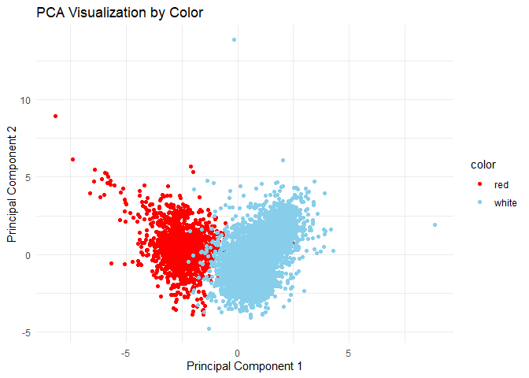
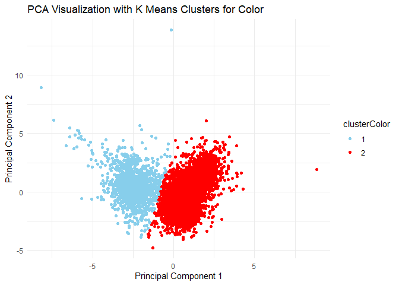
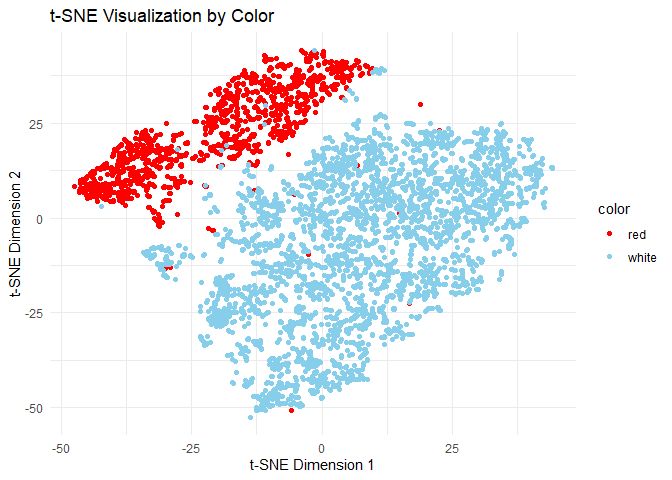
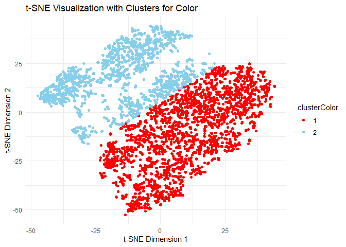
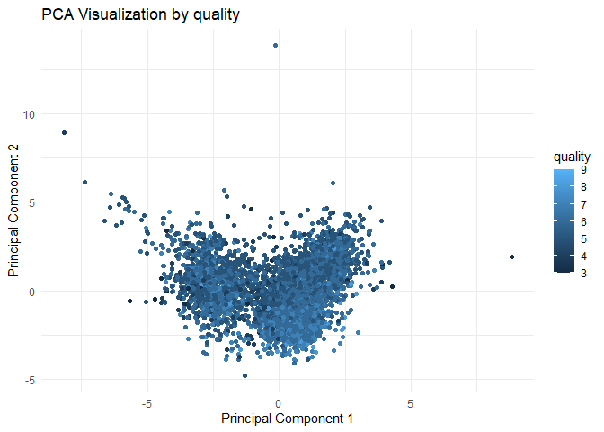
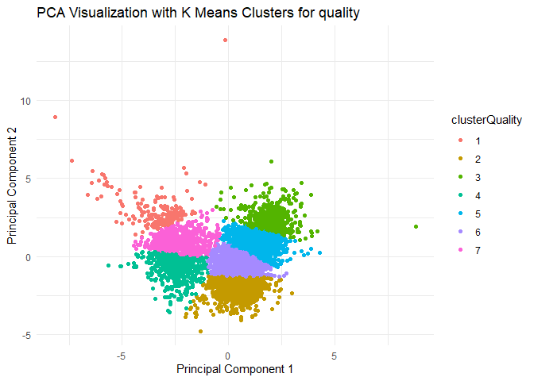

Q5. Clustering and dimensionality reduction
================

<b> The data in wine.csv contains information on 11 chemical properties
of 6500 different bottles of vinho verde wine from northern Portugal. In
addition, two other variables about each wine are recorded:

    whether the wine is red or white
    the quality of the wine, as judged on a 1-10 scale by a panel of certified wine snobs.

Run PCA, tSNE, and any clustering algorithm of your choice on the 11
chemical properties (or suitable transformations thereof) and summarize
your results. Which dimensionality reduction technique makes the most
sense to you for this data? Convince yourself (and me) that your chosen
approach is easily capable of distinguishing the reds from the whites,
using only the “unsupervised” information contained in the data on
chemical properties. Does your unsupervised technique also seem capable
of distinguishing the higher from the lower quality wines? Present
appropriate numerical and/or visual evidence to support your
conclusions.

To clarify: I’m not asking you to run a supervised learning algorithms.
Rather, I’m asking you to see whether the differences in the labels
(red/white and quality score) emerge naturally from applying an
unsupervised technique to the chemical properties. This should be
straightforward to assess using plots. </b>

**Solutions:**

``` r
library(dplyr)
```

    ## 
    ## Attaching package: 'dplyr'

    ## The following objects are masked from 'package:stats':
    ## 
    ##     filter, lag

    ## The following objects are masked from 'package:base':
    ## 
    ##     intersect, setdiff, setequal, union

``` r
library(ggplot2)
library(Rtsne)
```

    ## Warning: package 'Rtsne' was built under R version 4.0.5

``` r
wine = read.csv('wine.csv')

wine = unique(wine)

wineSubset = select(wine, -color, -quality)
wineSubsetScaled = scale(wineSubset)

duplicate_rows = duplicated(wineSubsetScaled) | duplicated(wineSubsetScaled, fromLast = TRUE)

wineSubsetScaled = wineSubsetScaled[!duplicate_rows, ]
wine = wine[!duplicate_rows, ]

pcaResult = prcomp(wineSubsetScaled, scale = TRUE)
```

Visualize the first two principal components by color since there are
just 2 categories of interest in color

``` r
pcaDataColor = data.frame(PC1 = pcaResult$x[, 1], PC2 = pcaResult$x[, 2], color = wine$color)
ggplot(pcaDataColor, aes(x = PC1, y = PC2, color = color)) +
  geom_point() +
  labs(title = "PCA Visualization by Color", x = "Principal Component 1", y = "Principal Component 2") +
  scale_color_manual(values = c("white" = "skyblue", "red" = "red"))+
  theme_minimal()
```

<!-- -->
**Question: ** Convince yourself (and me) that your chosen approach is
easily capable of distinguishing the reds from the whites, using only
the “unsupervised” information contained in the data on chemical
properties.

As we can see from the graph above, there are two dense clusters (red
and white wine) in close vicinity after reducing the dimensions to 2
from only the unsupervised information in the datausing PCA.

Performing clustering on PCA

``` r
K = 2
kmeansPCAResultColor = kmeans(pcaDataColor[, 1:2], centers = K, nstart = 20)
pcaDataColor$clusterColor = as.factor(kmeansPCAResultColor$cluster)
```

Visualize PCA with clusters for colors

``` r
ggplot(pcaDataColor, aes(x = PC1, y = PC2, color = clusterColor)) +
  geom_point() +
  labs(title = "PCA Visualization with K Means Clusters for Color", x = "Principal Component 1", y = "Principal Component 2") +
  scale_color_manual(values = c("1" = "skyblue", "2" = "red"))+
  theme_minimal()
```

<!-- -->

``` r
pcaConfusionMatrix = table(pcaDataColor$color, pcaDataColor$clusterColor)

print(paste("Accuracy of PCA with K Means clustering:", sum(diag(prop.table(pcaConfusionMatrix)*100))))
```

    ## [1] "Accuracy of PCA with K Means clustering: 98.1565086531227"

**t-SNE**

``` r
tsneResult = Rtsne(wineSubsetScaled, dims = 2)
tsneData = data.frame(TSNE_1 = tsneResult$Y[, 1], TSNE_2 = tsneResult$Y[, 2], color = wine$color)
```

Visualize t-SNE by color

``` r
ggplot(tsneData, aes(x = TSNE_1, y = TSNE_2, color = color)) +
  geom_point() +
  labs(title = "t-SNE Visualization by Color", x = "t-SNE Dimension 1", y = "t-SNE Dimension 2") +
  scale_color_manual(values = c("white" = "skyblue", "red" = "red"))+
  theme_minimal()
```

<!-- -->

Observation: t-SNE has a defined boundary compared with PCA

Performing K-Means on t-SNE reduced data frame

``` r
K = 2
kmeansTSNEResultColor = kmeans(tsneData[, 1:2], centers = K, nstart = 20)
tsneData$clusterColor = as.factor(kmeansTSNEResultColor$cluster)
```

Visualize t-SNE with clusters for color

``` r
ggplot(tsneData, aes(x = TSNE_1, y = TSNE_2, color = clusterColor)) +
  geom_point() +
  labs(title = "t-SNE Visualization with Clusters for Color", x = "t-SNE Dimension 1", y = "t-SNE Dimension 2") +
  scale_color_manual(values = c("2" = "skyblue", "1" = "red"))+
  theme_minimal()
```

<!-- -->

``` r
tSNEColorConfusionMatrix = table(tsneData$color, tsneData$clusterColor)
```

Accuracy:

``` r
print(paste("t-SNE accuracy with Clusters:", 100 - sum(diag(prop.table(tSNEColorConfusionMatrix)))*100))
```

    ## [1] "t-SNE accuracy with Clusters: 86.1361926260346"

**Question:** Which dimensionality reduction technique makes the most
sense to you for this data?

PCA does.

**Going ahead with PCA because t-SNE has lesser accuracy relatively.**

Visualize the principal components by quality

``` r
pcaDataQuality = data.frame(PC1 = pcaResult$x[, 1], PC2 = pcaResult$x[, 2], quality = wine$quality)
ggplot(pcaDataQuality, aes(x = PC1, y = PC2, color = quality)) +
  geom_point() +
  labs(title = "PCA Visualization by quality", x = "Principal Component 1", y = "Principal Component 2") +
  theme_minimal()
```

<!-- -->
Perform clustering on PCA to cluster quality

``` r
K = 7
kmeansPCAResultQuality = kmeans(pcaDataQuality[, 1:2], centers = K, nstart = 20)
pcaDataQuality$clusterQuality = as.factor(kmeansPCAResultQuality$cluster)
```

Visualize PCA with clusters for quality

``` r
ggplot(pcaDataQuality, aes(x = PC1, y = PC2, color = clusterQuality)) +
  geom_point() +
  labs(title = "PCA Visualization with K Means Clusters for quality", x = "Principal Component 1", y = "Principal Component 2") +
  theme_minimal()
```

<!-- -->

As we can see, the graph plotted before the above shows a dispersed
plot, and the above clustered chart doesn’t show the same.

Grouping by cluster to see if the mean values are separated:

``` r
pcaDataQuality %>% group_by(clusterQuality) %>% summarise(mean(quality))
```

    ## # A tibble: 7 x 2
    ##   clusterQuality `mean(quality)`
    ##   <fct>                    <dbl>
    ## 1 1                         5.57
    ## 2 2                         6.34
    ## 3 3                         5.51
    ## 4 4                         5.65
    ## 5 5                         5.64
    ## 6 6                         5.82
    ## 7 7                         5.51

To confirm, these clusters are not capable of clustering these wines
based on its characteristics to predict wine quality.

Thus the evidence for inefficiency of clustering on this dataset to
distinguish low and high quality has been supported by the table above.
