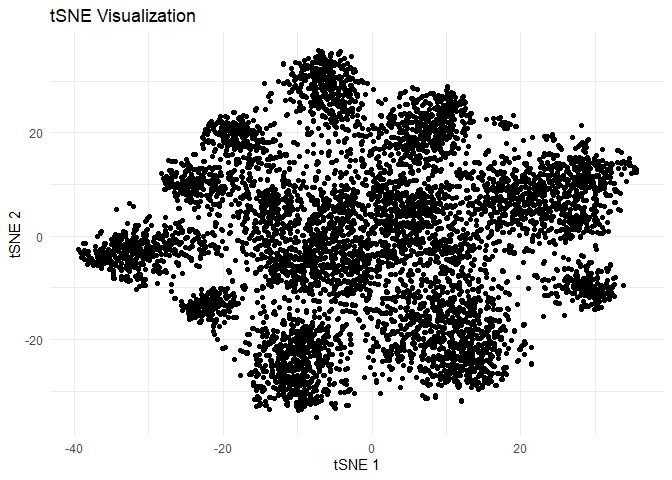
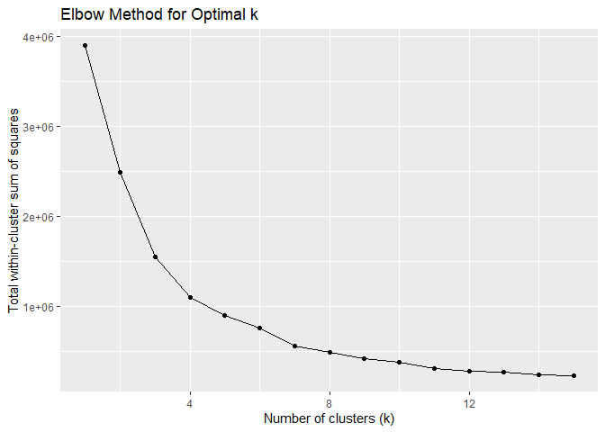
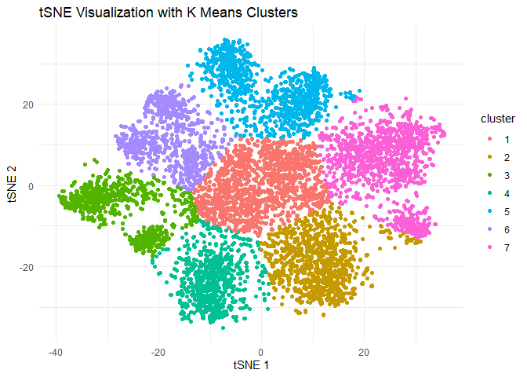

Q6. Market segmentation
================

Consider the data in social_marketing.csv. This was data collected in
the course of a market-research study using followers of the Twitter
account of a large consumer brand that shall remain nameless—let’s call
it “NutrientH20” just to have a label. The goal here was for NutrientH20
to understand its social-media audience a little bit better, so that it
could hone its messaging a little more sharply.

A bit of background on the data collection: the advertising firm who
runs NutrientH20’s online-advertising campaigns took a sample of the
brand’s Twitter followers. They collected every Twitter post (“tweet”)
by each of those followers over a seven-day period in June 2014. Every
post was examined by a human annotator contracted through Amazon’s
Mechanical Turk service. Each tweet was categorized based on its content
using a pre-specified scheme of 36 different categories, each
representing a broad area of interest (e.g. politics, sports, family,
etc.) Annotators were allowed to classify a post as belonging to more
than one category. For example, a hypothetical post such as “I’m really
excited to see grandpa go wreck shop in his geriatic soccer league this
Sunday!” might be categorized as both “family” and “sports.” You get the
picture.

Each row of social_marketing.csv represents one user, labeled by a
random (anonymous, unique) 9-digit alphanumeric code. Each column
represents an interest, which are labeled along the top of the data
file. The entries are the number of posts by a given user that fell into
the given category. Two interests of note here are “spam”
(i.e. unsolicited advertising) and “adult” (posts that are pornographic,
salacious, or explicitly sexual). There are a lot of spam and
pornography “bots” on Twitter; while these have been filtered out of the
data set to some extent, there will certainly be some that slip through.
There’s also an “uncategorized” label. Annotators were told to use this
sparingly, but it’s there to capture posts that don’t fit at all into
any of the listed interest categories. (A lot of annotators may used the
“chatter” category for this as well.) Keep in mind as you examine the
data that you cannot expect perfect annotations of all posts. Some
annotators might have simply been asleep at the wheel some, or even all,
of the time! Thus there is some inevitable error and noisiness in the
annotation process.

Your task to is analyze this data as you see fit, and to prepare a
concise report for NutrientH20 that identifies any interesting market
segments that appear to stand out in their social-media audience. You
have complete freedom in deciding how to pre-process the data and how to
define “market segment.” (Is it a group of correlated interests? A
cluster? A latent factor? Etc.) Just use the data to come up with some
interesting, well-supported insights about the audience, and be clear
about what you did.

**Solutions:**

``` r
library(dplyr)
```

    ## 
    ## Attaching package: 'dplyr'

    ## The following objects are masked from 'package:stats':
    ## 
    ##     filter, lag

    ## The following objects are masked from 'package:base':
    ## 
    ##     intersect, setdiff, setequal, union

``` r
library(ggplot2)
library(Rtsne)
```

    ## Warning: package 'Rtsne' was built under R version 4.0.5

``` r
marketSegmentation = read.csv("social_marketing.csv")
```

\#Data Processing:

Removing all the records which has spam more than 0 and chatter values
above IQR\*1.5 + 75%

``` r
marketSegmentation = marketSegmentation[marketSegmentation$spam==0 & 
                                          marketSegmentation$chatter < 
                                          (IQR(marketSegmentation$chatter)*1.5 + quantile(marketSegmentation$chatter, probs = 0.75)),]

marketSegmentation$spam = NULL
```

**Approach taken to solve the problem:**

- Reduce the correlated variables using PCA
- Use t-SNE to further reduce it to 2 components
- Cluster the reduced components to bucket different classes of people

Reducing correlated variables using PCA:

``` r
marketSegmentationScale = as.data.frame(scale(select(marketSegmentation, -X)))

pcaMarketSegmenationResult = prcomp(marketSegmentationScale)

varianceExplained = pcaMarketSegmenationResult$sdev^2
percentageVarianceExplained = varianceExplained / sum(varianceExplained) * 100
cumulativePercentageVarianceExplained = cumsum(percentageVarianceExplained)

cumulativePercentageVarianceExplained
```

    ##  [1]  12.70743  20.97334  28.26168  34.99161  41.21697  46.25341  50.98744
    ##  [8]  55.08047  58.34632  61.35466  64.25043  66.94653  69.60398  72.17060
    ## [15]  74.65945  77.06431  79.36763  81.44047  83.29330  84.89692  86.29987
    ## [22]  87.65254  88.98664  90.19217  91.38248  92.55296  93.70335  94.76849
    ## [29]  95.78523  96.77998  97.64087  98.30835  98.95065  99.49716 100.00000

Picking number of components which can explain 95% of variance:

``` r
table(cumulativePercentageVarianceExplained < 95)
```

    ## 
    ## FALSE  TRUE 
    ##     7    28

Number of components = 28

Performing t-SNE and plotting it on 2D space:

``` r
pcaMarketSegmenation = pcaMarketSegmenationResult$x[,1:28]

tsneResult = Rtsne(pcaMarketSegmenation, dims = 2)
tsneData = data.frame(marketSegmentation$X, TSNE_1 = tsneResult$Y[, 1], TSNE_2 = tsneResult$Y[, 2])

ggplot(tsneData, aes(x = TSNE_1, y = TSNE_2)) +
  geom_point() +
  labs(title = "tSNE Visualization", x = "tSNE 1", y = "tSNE 2") +
  theme_minimal()
```

<!-- -->

We observe multiple small clusters spread out in floral shape.

Identify optimal number of clusters in K means++ using elbow method:

``` r
wss = numeric(15)
for (k in 1:15) {
  kmeans_result = kmeans(tsneData[c("TSNE_1", "TSNE_2")], centers = k)
  wss[k] = kmeans_result$tot.withinss
}

ggplot(data.frame(k = 1:15, wss = wss), aes(x = k, y = wss)) +
  geom_line() +
  geom_point() +
  ggtitle("Elbow Method for Optimal k") +
  xlab("Number of clusters (k)") +
  ylab("Total within-cluster sum of squares")
```

<!-- -->

Picking k = 7 as optimal number of cluster to cluster and visualing

``` r
optimalK = 7

kmeansTSNEResult = kmeans(tsneData[, 2:3], centers = optimalK, nstart = 20)
tsneData$cluster = as.factor(kmeansTSNEResult$cluster)

# Visualize PCA with clusters for colors
ggplot(tsneData, aes(x = TSNE_1, y = TSNE_2, color = cluster)) +
  geom_point() +
  labs(title = "tSNE Visualization with K Means Clusters", x = "tSNE 1", y = "tSNE 2") +
  theme_minimal()
```

<!-- -->

Now let us identify what these clusters signify with the original data
by looking at the traits of each cluster, aggregating by median.

``` r
marketSegmentationClustered = marketSegmentation %>% left_join(tsneData[c("marketSegmentation.X", "cluster")], by = c("X" = "marketSegmentation.X"))


clusterProfiles = select(marketSegmentationClustered, -X) %>%
  group_by(cluster) %>%
  summarise(across(everything(), median, na.rm = TRUE))
```

    ## Warning: There was 1 warning in `summarise()`.
    ## i In argument: `across(everything(), median, na.rm = TRUE)`.
    ## i In group 1: `cluster = 1`.
    ## Caused by warning:
    ## ! The `...` argument of `across()` is deprecated as of dplyr 1.1.0.
    ## Supply arguments directly to `.fns` through an anonymous function instead.
    ## 
    ##   # Previously
    ##   across(a:b, mean, na.rm = TRUE)
    ## 
    ##   # Now
    ##   across(a:b, \(x) mean(x, na.rm = TRUE))

``` r
as.data.frame(clusterProfiles)
```

    ##   cluster chatter current_events travel photo_sharing uncategorized tv_film
    ## 1       1       4              1      1             2             0       0
    ## 2       2       3              1      1             1             1       0
    ## 3       3       4              1      1             2             1       1
    ## 4       4       3              1      1             4             1       0
    ## 5       5       3              1      2             1             0       1
    ## 6       6       3              1      1             2             1       3
    ## 7       7       3              1      1             1             1       0
    ##   sports_fandom politics food family home_and_garden music news online_gaming
    ## 1             0      0.0    0      0               0     0    0             0
    ## 2             1      1.0    1      0               0     0    1             0
    ## 3             1      0.5    1      1               0     0    0             5
    ## 4             1      0.0    1      0               0     1    0             0
    ## 5             1      6.0    1      1               0     0    4             0
    ## 6             1      1.0    1      0               0     1    0             0
    ## 7             4      0.0    3      2               0     0    0             0
    ##   shopping health_nutrition college_uni sports_playing cooking eco computers
    ## 1        1                0           0              0       0   0         0
    ## 2        1                9           0              0       2   0         0
    ## 3        1                0           5              1       1   0         0
    ## 4        1                1           1              0       8   0         0
    ## 5        0                0           0              0       0   0         1
    ## 6        1                0           1              0       0   0         0
    ## 7        1                0           0              0       1   0         0
    ##   business outdoors crafts automotive art religion beauty parenting dating
    ## 1        0        0      0          0   0        0      0         0      0
    ## 2        0        2      0          0   0        0      0         0      0
    ## 3        0        0      0          0   0        0      0         0      0
    ## 4        0        0      0          0   0        0      3         0      0
    ## 5        0        1      0          2   0        0      0         1      0
    ## 6        0        0      0          0   0        0      0         0      0
    ## 7        0        0      1          0   0        3      1         2      0
    ##   school personal_fitness fashion small_business adult
    ## 1      0                0       0              0     0
    ## 2      0                5       0              0     0
    ## 3      0                0       1              0     0
    ## 4      0                1       4              0     0
    ## 5      0                0       0              0     0
    ## 6      0                0       0              1     0
    ## 7      1                0       0              0     0


**Brief summary of each of these profiles based on their median
values:**

- Cluster 1: Socially engaged users who frequently engage in chatter, share photos, and discuss travel.
- Cluster 2: Health-conscious individuals with interests in nutrition and personal fitness.
- Cluster 3: College students and online gamers who engage in online gaming and casual chatter.
- Cluster 4: Home chefs and fashion enthusiasts who love cooking and sharing photos.
- Cluster 5: Politically active users with strong opinions on politics and news.
- Cluster 6: Entertainment-focused audience with a love for TV, films, and photos.
- Cluster 7: Sports lovers who also engage in religious discussions.
