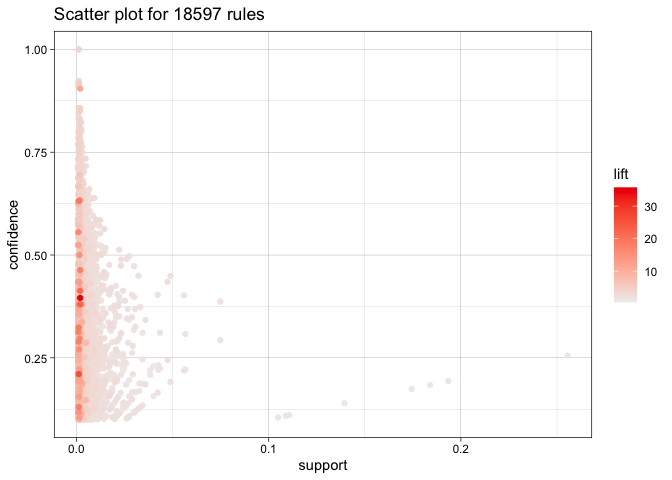
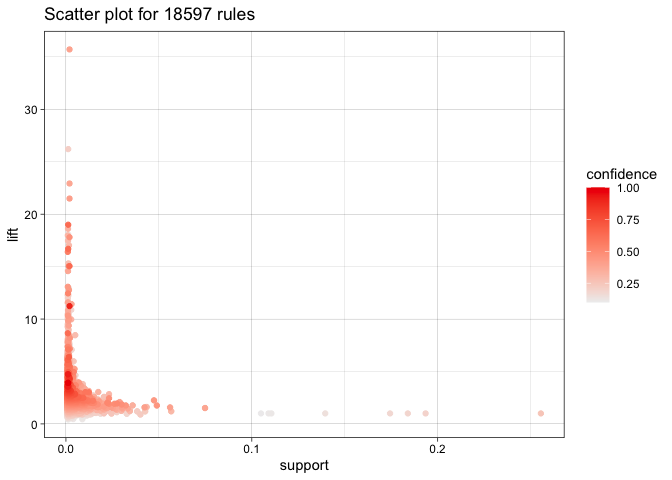
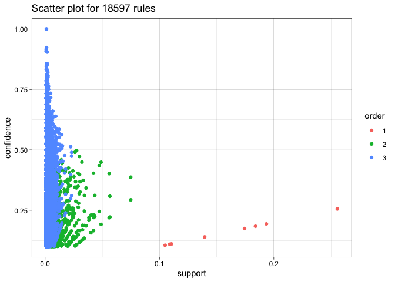

# Q8. Association Rule Mining

**Revisit the notes on association rule mining and the R example on
music playlists: playlists.R and playlists.csv. Then use the data on
grocery purchases in groceries.txt and find some interesting association
rules for these shopping baskets. The data file is a list of shopping
baskets: one person’s basket for each row, with multiple items per row
separated by commas. Pick your own thresholds for lift and confidence;
just be clear what these thresholds are and say why you picked them. Do
your discovered item sets make sense? Present your discoveries in an
interesting and visually appealing way.**

Note: This is an exercise in visual and numerical story-telling. Do be
clear in your description of what you’ve done, but keep the focus on the
data, the figures, and the insights your analysis has drawn from the
data, rather than technical details. The data file is a list of baskets:
one row per basket, with multiple items per row separated by commas.
You’ll have to cobble together your own code for processing this into
the format expected by the “arules” package. This is not intrinsically
all that hard, but it is the kind of data-wrangling wrinkle you’ll
encounter frequently on real problems, where your software package
expects data in one format and the data comes in a different format.
Figuring out how to bridge that gap is part of the assignment, and so we
won’t be giving tips on this front.

**Solution:**

    ## Loading required package: Matrix

    ## 
    ## Attaching package: 'arules'

    ## The following objects are masked from 'package:base':
    ## 
    ##     abbreviate, write

    ## ── Attaching core tidyverse packages ──────────────────────── tidyverse 2.0.0 ──
    ## ✔ dplyr     1.1.2     ✔ readr     2.1.4
    ## ✔ forcats   1.0.0     ✔ stringr   1.5.0
    ## ✔ ggplot2   3.4.2     ✔ tibble    3.2.1
    ## ✔ lubridate 1.9.2     ✔ tidyr     1.3.0
    ## ✔ purrr     1.0.1     
    ## ── Conflicts ────────────────────────────────────────── tidyverse_conflicts() ──
    ## ✖ tidyr::expand() masks Matrix::expand()
    ## ✖ dplyr::filter() masks stats::filter()
    ## ✖ dplyr::lag()    masks stats::lag()
    ## ✖ tidyr::pack()   masks Matrix::pack()
    ## ✖ dplyr::recode() masks arules::recode()
    ## ✖ tidyr::unpack() masks Matrix::unpack()
    ## ℹ Use the conflicted package (<http://conflicted.r-lib.org/>) to force all conflicts to become errors

``` r
summary(groceries)
```

    ## transactions as itemMatrix in sparse format with
    ##  9835 rows (elements/itemsets/transactions) and
    ##  169 columns (items) and a density of 0.02609146 
    ## 
    ## most frequent items:
    ##       whole milk other vegetables       rolls/buns             soda 
    ##             2513             1903             1809             1715 
    ##           yogurt          (Other) 
    ##             1372            34055 
    ## 
    ## element (itemset/transaction) length distribution:
    ## sizes
    ##    1    2    3    4    5    6    7    8    9   10   11   12   13   14   15   16 
    ## 2159 1643 1299 1005  855  645  545  438  350  246  182  117   78   77   55   46 
    ##   17   18   19   20   21   22   23   24   26   27   28   29   32 
    ##   29   14   14    9   11    4    6    1    1    1    1    3    1 
    ## 
    ##    Min. 1st Qu.  Median    Mean 3rd Qu.    Max. 
    ##   1.000   2.000   3.000   4.409   6.000  32.000 
    ## 
    ## includes extended item information - examples:
    ##             labels
    ## 1 abrasive cleaner
    ## 2 artif. sweetener
    ## 3   baby cosmetics

The most frequent items bought: whole milk, other vegetables,
rolls/buns, soda, yogurt.

**Apriori Algorithm:**

``` r
rules = apriori(groceries, parameter = list(support = 0.001, confidence = 0.1, maxlen=3))
```

    ## Apriori
    ## 
    ## Parameter specification:
    ##  confidence minval smax arem  aval originalSupport maxtime support minlen
    ##         0.1    0.1    1 none FALSE            TRUE       5   0.001      1
    ##  maxlen target  ext
    ##       3  rules TRUE
    ## 
    ## Algorithmic control:
    ##  filter tree heap memopt load sort verbose
    ##     0.1 TRUE TRUE  FALSE TRUE    2    TRUE
    ## 
    ## Absolute minimum support count: 9 
    ## 
    ## set item appearances ...[0 item(s)] done [0.00s].
    ## set transactions ...[169 item(s), 9835 transaction(s)] done [0.00s].
    ## sorting and recoding items ... [157 item(s)] done [0.00s].
    ## creating transaction tree ... done [0.00s].
    ## checking subsets of size 1 2 3

    ## Warning in apriori(groceries, parameter = list(support = 0.001, confidence =
    ## 0.1, : Mining stopped (maxlen reached). Only patterns up to a length of 3
    ## returned!

    ##  done [0.00s].
    ## writing ... [18597 rule(s)] done [0.00s].
    ## creating S4 object  ... done [0.00s].

``` r
top_20_rules <- rules[1:20]
inspect(top_20_rules)
```

    ##      lhs                    rhs                support     confidence
    ## [1]  {}                  => {bottled water}    0.110523640 0.1105236 
    ## [2]  {}                  => {tropical fruit}   0.104931368 0.1049314 
    ## [3]  {}                  => {root vegetables}  0.108998475 0.1089985 
    ## [4]  {}                  => {soda}             0.174377224 0.1743772 
    ## [5]  {}                  => {yogurt}           0.139501779 0.1395018 
    ## [6]  {}                  => {rolls/buns}       0.183934926 0.1839349 
    ## [7]  {}                  => {other vegetables} 0.193492628 0.1934926 
    ## [8]  {}                  => {whole milk}       0.255516014 0.2555160 
    ## [9]  {honey}             => {whole milk}       0.001118454 0.7333333 
    ## [10] {soap}              => {whole milk}       0.001118454 0.4230769 
    ## [11] {tidbits}           => {soda}             0.001016777 0.4347826 
    ## [12] {tidbits}           => {rolls/buns}       0.001220132 0.5217391 
    ## [13] {cocoa drinks}      => {whole milk}       0.001321810 0.5909091 
    ## [14] {snack products}    => {soda}             0.001118454 0.3666667 
    ## [15] {snack products}    => {rolls/buns}       0.001118454 0.3666667 
    ## [16] {pudding powder}    => {whole milk}       0.001321810 0.5652174 
    ## [17] {cooking chocolate} => {whole milk}       0.001321810 0.5200000 
    ## [18] {bathroom cleaner}  => {soda}             0.001016777 0.3703704 
    ## [19] {bathroom cleaner}  => {other vegetables} 0.001016777 0.3703704 
    ## [20] {nuts/prunes}       => {rolls/buns}       0.001016777 0.3030303 
    ##      coverage    lift     count
    ## [1]  1.000000000 1.000000 1087 
    ## [2]  1.000000000 1.000000 1032 
    ## [3]  1.000000000 1.000000 1072 
    ## [4]  1.000000000 1.000000 1715 
    ## [5]  1.000000000 1.000000 1372 
    ## [6]  1.000000000 1.000000 1809 
    ## [7]  1.000000000 1.000000 1903 
    ## [8]  1.000000000 1.000000 2513 
    ## [9]  0.001525165 2.870009   11 
    ## [10] 0.002643620 1.655775   11 
    ## [11] 0.002338587 2.493345   10 
    ## [12] 0.002338587 2.836542   12 
    ## [13] 0.002236909 2.312611   13 
    ## [14] 0.003050330 2.102721   11 
    ## [15] 0.003050330 1.993459   11 
    ## [16] 0.002338587 2.212062   13 
    ## [17] 0.002541942 2.035097   13 
    ## [18] 0.002745297 2.123961   10 
    ## [19] 0.002745297 1.914132   10 
    ## [20] 0.003355363 1.647486   10

``` r
summary(rules)
```

    ## set of 18597 rules
    ## 
    ## rule length distribution (lhs + rhs):sizes
    ##     1     2     3 
    ##     8  2121 16468 
    ## 
    ##    Min. 1st Qu.  Median    Mean 3rd Qu.    Max. 
    ##   1.000   3.000   3.000   2.885   3.000   3.000 
    ## 
    ## summary of quality measures:
    ##     support           confidence        coverage             lift        
    ##  Min.   :0.001017   Min.   :0.1000   Min.   :0.001118   Min.   : 0.4193  
    ##  1st Qu.:0.001220   1st Qu.:0.1471   1st Qu.:0.005084   1st Qu.: 1.7695  
    ##  Median :0.001627   Median :0.2083   Median :0.008032   Median : 2.2620  
    ##  Mean   :0.002553   Mean   :0.2523   Mean   :0.012901   Mean   : 2.5042  
    ##  3rd Qu.:0.002542   3rd Qu.:0.3182   3rd Qu.:0.012913   3rd Qu.: 2.9558  
    ##  Max.   :0.255516   Max.   :1.0000   Max.   :1.000000   Max.   :35.7158  
    ##      count        
    ##  Min.   :  10.00  
    ##  1st Qu.:  12.00  
    ##  Median :  16.00  
    ##  Mean   :  25.11  
    ##  3rd Qu.:  25.00  
    ##  Max.   :2513.00  
    ## 
    ## mining info:
    ##       data ntransactions support confidence
    ##  groceries          9835   0.001        0.1
    ##                                                                                        call
    ##  apriori(data = groceries, parameter = list(support = 0.001, confidence = 0.1, maxlen = 3))

The most frequent individual items purchased are bottled water, tropical
fruit, root vegetables, soda, yogurt, rolls/buns, other vegetables, and
whole milk. These items have high support values, indicating their
prevalence in the transactions. The lift value of 1.0 indicates that
these items are purchased independently, as their presence or absence
doesn’t influence each other.

**{honey} =\> {whole milk}:** Customers buying “honey” are likely to buy
“whole milk” with a confidence of 73.33%, suggesting a common
combination, while the support for {whole milk} individually is just
25.5%

**{tidbits} =\> {soda}:** Customers purchasing “tidbits” tend to
purchase “soda” as well with a confidence of 43.48%, and the support for
getting {soda} individually is shown as 17.4%

**Related Categories: {cooking chocolate} =\> {whole milk}:** Customers
buying “cooking chocolate” are likely to buy “whole milk” with a
confidence of 52%. This suggests an association between cooking
ingredients and dairy products.

**Unrelated Categories:** Rules like **{bathroom cleaner} =\> {soda}**
and **{bathroom cleaner} =\> {other vegetables}** might indicate that
customers who buy cleaning products like “bathroom cleaner” also tend to
buy food items like “soda” and “other vegetables.”

**Pick your own thresholds for lift and confidence; just be clear what
these thresholds are and say why you picked them**

1.  lift \> 15 : A high lift value indicates a strong association
    between items. Generally, a lift value greater than 1 signifies a
    positive association. Choosing a threshold like 15 filters out rules
    that are significantly stronger than random chance, ensuring that we
    focus on the most valuable relationships.

2.  confidence \> 0.3 : By setting a confidence threshold of 30%, we can
    filter out weaker associations and focus on the more significant and
    reliable relationships between items, and Including all rules might
    lead to numerous less meaningful associations. Sub-setting allows us
    to highlight the most relevant insights.

3.  lift \> 10 & confidence \> 0.5 : This subset is chosen based on two
    criteria: rules with a “lift” value greater than 10, indicating
    strong associations, and rules with a “confidence” value higher than
    0.5, indicating reliable predictions. By applying these filters, the
    code focuses on extracting rules that not only represent strong
    connections between items but also provide dependable insights. This
    approach is useful for uncovering significant and practically
    relevant patterns in transaction data, which can be valuable for
    decision-making in fields like marketing and recommendation systems.

**Do your discovered item sets make sense? Present your discoveries in
an interesting and visually appealing way.**

``` r
inspect(subset(rules, subset=lift > 15))
```

    ##      lhs                                    rhs                     support    
    ## [1]  {bottled beer, liquor}              => {red/blush wine}        0.001931876
    ## [2]  {bottled beer, red/blush wine}      => {liquor}                0.001931876
    ## [3]  {popcorn, soda}                     => {salty snack}           0.001220132
    ## [4]  {salty snack, soda}                 => {popcorn}               0.001220132
    ## [5]  {Instant food products, soda}       => {hamburger meat}        0.001220132
    ## [6]  {hamburger meat, soda}              => {Instant food products} 0.001220132
    ## [7]  {Instant food products, whole milk} => {hamburger meat}        0.001525165
    ## [8]  {ham, processed cheese}             => {white bread}           0.001931876
    ## [9]  {processed cheese, white bread}     => {ham}                   0.001931876
    ## [10] {ham, white bread}                  => {processed cheese}      0.001931876
    ## [11] {fruit/vegetable juice, ham}        => {processed cheese}      0.001118454
    ## [12] {baking powder, flour}              => {sugar}                 0.001016777
    ## [13] {baking powder, sugar}              => {flour}                 0.001016777
    ## [14] {sugar, whipped/sour cream}         => {baking powder}         0.001321810
    ## [15] {curd, sugar}                       => {flour}                 0.001118454
    ## [16] {margarine, sugar}                  => {flour}                 0.001626843
    ##      confidence coverage    lift     count
    ## [1]  0.4130435  0.004677173 21.49356 19   
    ## [2]  0.3958333  0.004880529 35.71579 19   
    ## [3]  0.6315789  0.001931876 16.69779 12   
    ## [4]  0.1304348  0.009354347 18.06797 12   
    ## [5]  0.6315789  0.001931876 18.99565 12   
    ## [6]  0.2105263  0.005795628 26.20919 12   
    ## [7]  0.5000000  0.003050330 15.03823 15   
    ## [8]  0.6333333  0.003050330 15.04549 19   
    ## [9]  0.4634146  0.004168785 17.80345 19   
    ## [10] 0.3800000  0.005083884 22.92822 19   
    ## [11] 0.2894737  0.003863752 17.46610 11   
    ## [12] 0.5555556  0.001830198 16.40807 10   
    ## [13] 0.3125000  0.003253686 17.97332 10   
    ## [14] 0.2708333  0.004880529 15.30831 13   
    ## [15] 0.3235294  0.003457041 18.60767 11   
    ## [16] 0.2962963  0.005490595 17.04137 16

**{bottled beer, liquor} =\> {red/blush wine}:** Customers who buy both
“bottled beer” and “liquor” are highly likely to also purchase
“red/blush wine.” The high lift value of 21.49 indicates a strong
association between these alcohol items.

**{bottled beer, red/blush wine} =\> {liquor}:** Similarly, customers
who purchase “bottled beer” and “red/blush wine” are likely to buy
“liquor,” with a lift value of 35.71.

**{baking powder, flour} =\> {sugar}:** Customers purchasing “baking
powder” and “flour” are likely to buy “sugar.” The lift of 16.41
suggests a connection between these baking ingredients.

``` r
inspect(subset(top_20_rules, subset=confidence > 0.3))
```

    ##      lhs                    rhs                support     confidence
    ## [1]  {honey}             => {whole milk}       0.001118454 0.7333333 
    ## [2]  {soap}              => {whole milk}       0.001118454 0.4230769 
    ## [3]  {tidbits}           => {soda}             0.001016777 0.4347826 
    ## [4]  {tidbits}           => {rolls/buns}       0.001220132 0.5217391 
    ## [5]  {cocoa drinks}      => {whole milk}       0.001321810 0.5909091 
    ## [6]  {snack products}    => {soda}             0.001118454 0.3666667 
    ## [7]  {snack products}    => {rolls/buns}       0.001118454 0.3666667 
    ## [8]  {pudding powder}    => {whole milk}       0.001321810 0.5652174 
    ## [9]  {cooking chocolate} => {whole milk}       0.001321810 0.5200000 
    ## [10] {bathroom cleaner}  => {soda}             0.001016777 0.3703704 
    ## [11] {bathroom cleaner}  => {other vegetables} 0.001016777 0.3703704 
    ## [12] {nuts/prunes}       => {rolls/buns}       0.001016777 0.3030303 
    ##      coverage    lift     count
    ## [1]  0.001525165 2.870009 11   
    ## [2]  0.002643620 1.655775 11   
    ## [3]  0.002338587 2.493345 10   
    ## [4]  0.002338587 2.836542 12   
    ## [5]  0.002236909 2.312611 13   
    ## [6]  0.003050330 2.102721 11   
    ## [7]  0.003050330 1.993459 11   
    ## [8]  0.002338587 2.212062 13   
    ## [9]  0.002541942 2.035097 13   
    ## [10] 0.002745297 2.123961 10   
    ## [11] 0.002745297 1.914132 10   
    ## [12] 0.003355363 1.647486 10

**{tidbits} =\> {rolls/buns}:**Similarly, customers who buy “tidbits”
have a confidence of 52.17% to buy “rolls/buns.” These associations
might be due to snack preferences or consumption patterns.

**{pudding powder} =\> {whole milk}:**Customers who buy “pudding powder”
are likely to purchase “whole milk” with a confidence of 56.52%. This
could be due to the use of milk in preparing pudding.

``` r
inspect(subset(rules, subset=lift > 10 & confidence > 0.5))
```

    ##     lhs                                  rhs              support    
    ## [1] {liquor, red/blush wine}          => {bottled beer}   0.001931876
    ## [2] {popcorn, soda}                   => {salty snack}    0.001220132
    ## [3] {Instant food products, soda}     => {hamburger meat} 0.001220132
    ## [4] {ham, processed cheese}           => {white bread}    0.001931876
    ## [5] {domestic eggs, processed cheese} => {white bread}    0.001118454
    ## [6] {baking powder, flour}            => {sugar}          0.001016777
    ##     confidence coverage    lift     count
    ## [1] 0.9047619  0.002135231 11.23527 19   
    ## [2] 0.6315789  0.001931876 16.69779 12   
    ## [3] 0.6315789  0.001931876 18.99565 12   
    ## [4] 0.6333333  0.003050330 15.04549 19   
    ## [5] 0.5238095  0.002135231 12.44364 11   
    ## [6] 0.5555556  0.001830198 16.40807 10

**{liquor, red/blush wine} =\> {bottled beer}:**This rule has a
confidence of 90.48% and a lift of 11.24. Customers who buy “liquor” and
“red/blush wine” are highly likely to buy “bottled beer” as well. This
might suggest that customers who purchase alcoholic beverages tend to
buy a variety of them.

**{popcorn, soda} =\> {salty snack}:** With a confidence of 63.16% and a
lift of 16.70, customers who buy “popcorn” and “soda” are likely to
purchase “salty snack” as well. This rule could represent common
snacking patterns.

**{ham, processed cheese} =\> {white bread}:** With a confidence of
63.33% and a lift of 15.05, customers who buy “ham” and “processed
cheese” are likely to purchase “white bread” as well. This might
indicate a preference for making sandwiches or similar items

**{domestic eggs, processed cheese} =\> {white bread}:**This rule has a
confidence of 52.38% and a lift of 12.44. Customers who buy “domestic
eggs” and “processed cheese” are likely to purchase “white bread.”
Similar to the previous rule, this could suggest a preference for
breakfast items or sandwiches.

``` r
plot(rules, jitter =0)
```

<!-- -->

It can be observed that high lift rules tend to have low support. High
lift rules with low support can provide valuable insights about specific
interactions between items that might not be immediately obvious from
looking at high-support items.

**Swapping the axes and color scales:**

``` r
plot(rules, jitter = 0, measure = c("support", "lift"), shading = "confidence")
```

<!-- -->

**“Two key” plot: coloring is by size (order) of item set**

``` r
plot(rules, method='two-key plot', jitter =0)
```

<!-- -->

**Pick your own thresholds for lift and confidence; just be clear what
these thresholds are and say why you picked them**

1.  support \> 0.05 : The chosen support threshold of **0.05** captures
    relatively common associations while allowing for more general
    patterns to be uncovered. This presents associations among
    frequently bought items, showcasing moderate associations between
    items that are commonly purchased together. This type of analysis
    provides insights into customer behavior and potential marketing
    opportunities.

2.  confidence \> 0.5 : The high-confidence association rules reveal
    strong buying patterns that can be leveraged for marketing and sales
    strategies. The chosen threshold(**confidence = 50%**) emphasizes
    confident and meaningful associations, making it easier to make
    informed business decisions.

3.  lift \> 25 : The rules in this subset have exceptionally high lift
    values, exceeding 25. High lift values indicate that the presence of
    the items on the left-hand side (LHS) significantly increases the
    likelihood of the items on the right-hand side (RHS) being bought.

**Do your discovered item sets make sense? Present your discoveries in
an interesting and visually appealing way.**

``` r
inspect(subset(rules, support > 0.05))
```

    ##      lhs                   rhs                support    confidence coverage 
    ## [1]  {}                 => {bottled water}    0.11052364 0.1105236  1.0000000
    ## [2]  {}                 => {tropical fruit}   0.10493137 0.1049314  1.0000000
    ## [3]  {}                 => {root vegetables}  0.10899847 0.1089985  1.0000000
    ## [4]  {}                 => {soda}             0.17437722 0.1743772  1.0000000
    ## [5]  {}                 => {yogurt}           0.13950178 0.1395018  1.0000000
    ## [6]  {}                 => {rolls/buns}       0.18393493 0.1839349  1.0000000
    ## [7]  {}                 => {other vegetables} 0.19349263 0.1934926  1.0000000
    ## [8]  {}                 => {whole milk}       0.25551601 0.2555160  1.0000000
    ## [9]  {yogurt}           => {whole milk}       0.05602440 0.4016035  0.1395018
    ## [10] {whole milk}       => {yogurt}           0.05602440 0.2192598  0.2555160
    ## [11] {rolls/buns}       => {whole milk}       0.05663447 0.3079049  0.1839349
    ## [12] {whole milk}       => {rolls/buns}       0.05663447 0.2216474  0.2555160
    ## [13] {other vegetables} => {whole milk}       0.07483477 0.3867578  0.1934926
    ## [14] {whole milk}       => {other vegetables} 0.07483477 0.2928770  0.2555160
    ##      lift     count
    ## [1]  1.000000 1087 
    ## [2]  1.000000 1032 
    ## [3]  1.000000 1072 
    ## [4]  1.000000 1715 
    ## [5]  1.000000 1372 
    ## [6]  1.000000 1809 
    ## [7]  1.000000 1903 
    ## [8]  1.000000 2513 
    ## [9]  1.571735  551 
    ## [10] 1.571735  551 
    ## [11] 1.205032  557 
    ## [12] 1.205032  557 
    ## [13] 1.513634  736 
    ## [14] 1.513634  736

If a customer buys rolls/buns, there’s a moderate chance they’ll also
buy whole milk. This insight can inform product placement or promotional
strategies.

The confidence values in this subset of rules generally range from
around **0.2** to **0.4**, indicating moderate confidence in these
associations

The rule **{yogurt} =\> {whole milk}** suggests that customers who buy
yogurt are likely to buy whole milk as well, and vice-versa.

``` r
inspect(subset(top_20_rules, confidence > 0.5))
```

    ##     lhs                    rhs          support     confidence coverage   
    ## [1] {honey}             => {whole milk} 0.001118454 0.7333333  0.001525165
    ## [2] {tidbits}           => {rolls/buns} 0.001220132 0.5217391  0.002338587
    ## [3] {cocoa drinks}      => {whole milk} 0.001321810 0.5909091  0.002236909
    ## [4] {pudding powder}    => {whole milk} 0.001321810 0.5652174  0.002338587
    ## [5] {cooking chocolate} => {whole milk} 0.001321810 0.5200000  0.002541942
    ##     lift     count
    ## [1] 2.870009 11   
    ## [2] 2.836542 12   
    ## [3] 2.312611 13   
    ## [4] 2.212062 13   
    ## [5] 2.035097 13

The rule **{honey} =\> {whole milk}** has a confidence of approximately
**0.73**. This implies that when a customer buys honey, there’s a high
likelihood (73%) they will also buy whole milk. So, if honey and whole
milk are placed close to each other, it might encourage more customers
to buy both items.

The other rules also show strong associations. For instance, items like
tidbits are often associated with rolls/buns, cocoa drinks are linked
with whole milk, and cooking chocolate is connected to whole milk.

In this subset, lift values are above **2** for all rules, indicating
significant association.

``` r
inspect(subset(rules, lift > 25))
```

    ##     lhs                               rhs                     support    
    ## [1] {bottled beer, red/blush wine} => {liquor}                0.001931876
    ## [2] {hamburger meat, soda}         => {Instant food products} 0.001220132
    ##     confidence coverage    lift     count
    ## [1] 0.3958333  0.004880529 35.71579 19   
    ## [2] 0.2105263  0.005795628 26.20919 12

The rule **{bottled beer, red/blush wine} =\> {liquor}** has a lift of
approximately **35.72.** This suggests that when customers buy bottled
beer and red/blush wine together, they are significantly more likely to
also purchase liquor.

In retail settings, placing related items in close proximity can
encourage customers to buy complementary products, leading to increased
sales.

While these rules have high lift, they might be based on a smaller
number of transactions, and therefore their applicability could be
limited.
